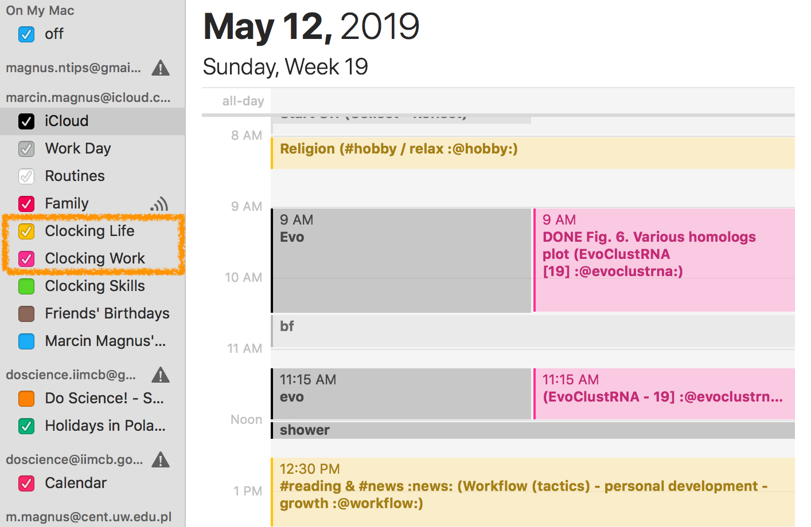

OrgModeClocking2Calendar
-------------------------------------------------------------------------------
The script will perform one way synchronization of your clocking (time tracking) entries [1] from OrgMode Emacs.

    $ ./OrgModeClocking2Calendar.py -h
    usage: OrgModeClocking2Calendar.py [-h] [--debug] [-d DAYS] [-v] [--log LOG]
                                       [--date DATE] [--dry]
                                       calendar file

    - fix arguments not to be hard coded
    - solve a problem if there is no log file

    Required:
    - empty files with logs

    positional arguments:
      calendar              calendar you want to send your data to
      file                  an OrgMode file

    optional arguments:
      -h, --help            show this help message and exit
      --debug               be verbose
      -d DAYS, --days DAYS
      -v, --verbose
      --log LOG
      --date DATE           in format 2010-01-01
      --dry

Example:

    $ ./OrgModeTimeTracker2Calendar.py 'Clocking Life' ~/Dropbox/geekbook/notes/work-curr.org
    ∆: 17 days, 12:47:34.673081 cutoff: 1 day, 0:00:00 use it: False
    2019-04-26 Fri 10:34 =>  0:02
    Marcin Magnus, PhD https://mmagnus.io  Friday, April 26, 2019 10:32 AM None
    Skip this task, too old!
    ∆: 179 days, 11:24:34.673436 cutoff: 1 day, 0:00:00 use it: False
    2018-11-15 Thu 16:00 =>  4:05
    Marcin Magnus, PhD https://mmagnus.io Talk with science people Thursday, November 15, 2018 11:55 AM None
    Skip this task, too old!
    ∆: 314 days, 9:19:34.673474 cutoff: 1 day, 0:00:00 use it: False
    2018-07-03 Tue 14:37 =>  0:37
    Marcin Magnus, PhD https://mmagnus.io Talk with science people Tuesday, July 03, 2018 02:00 PM None
    Skip this task, too old!
    (...)

The script is straightforward, it's a hack in some sense. For each clocking entry, an Apple Script is generated and Apple Tell is executed to push a new even to selected Calendar. Works only on Mac. All already entered entries go to a log file, so they are not entered one again.

[1] https://orgmode.org/manual/Clocking-commands.html#Clocking-commands
